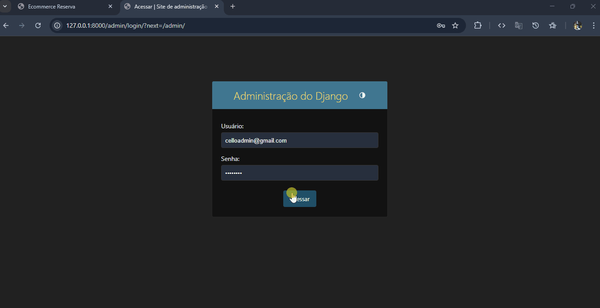

# 🛒 E-commerce com Django

Este é um projeto completo de e-commerce desenvolvido com **Django** como parte do curso da [Hashtag Treinamentos](https://www.hashtagtreinamentos.com/). O sistema permite cadastro e autenticação de usuários, gerenciamento de produtos e estoque, controle de pedidos, painel administrativo, geração de relatórios e integração com o **Mercado Pago** para pagamentos.

---

## 🔧 Tecnologias utilizadas

- **Python 3**
- **Django**
- **SQLite**
- **HTML5/CSS3**
- **Bootstrap**
- **Mercado Pago SDK**
- **Django Admin**
- **venv** (ambiente virtual)

---

## 🖥️ Funcionalidades

- Cadastro e login de usuários
- Listagem de produtos na loja
- Carrinho de compras
- Processo de checkout com pagamento integrado
- Sistema de pedidos com status
- Administração de produtos, pedidos e estoque via painel admin
- Geração de relatórios no painel administrativo

---

## 🚀 Como rodar o projeto localmente

1. **Clone o repositório**

```bash
git clone https://github.com/marcelloprado/ecommerce-python
cd seu-repositorio
```

2. **Crie e ative um ambiente virtual**<br>
Linux/Mac:
```
python3 -m venv venv
source venv/bin/activate
```
Windows:
```
python -m venv venv
venv\Scripts\activate
```

3. **Instale as dependências**
```
pip install -r requirements.txt
```

4. **Configure variáveis de ambiente** <br>
Crie um arquivo **.env** (ou configure diretamente no **settings.py** para testes locais) com suas credenciais do Mercado Pago e demais configs.

5. **Aplique as migrações e rode o servidor**
```
python manage.py migrate
python manage.py runserver

```
6. **Acesse o sistema**<br>
Abra o navegador e vá para:
```
http://127.0.0.1:8000/
```
📷 Prints do sistema
<p align="center">
  
</p>

👨‍💻 Autor
Desenvolvido por ***Marcello Prado*** durante os estudos com Django.
          
           
          
